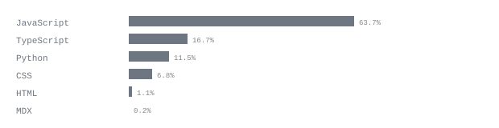
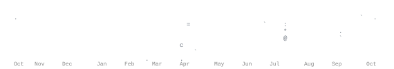

[portfolio](https://lackilohar.netlify.app) &nbsp;·&nbsp;
[instagram](https://www.instagram.com/luckyp4nch4l/) &nbsp;·&nbsp;
[linkedin](https://www.linkedin.com/in/lackilohar/) &nbsp;·&nbsp;
[email](mailto:luckykanti31122006@gmail.com)

> CSE undergrad · 3rd year · Ahmedabad, Gujarat. 
> See you at the TOP - the bottom is too CROWDED.

Building at the intersection of AI and full-stack engineering. Currently 
focused on shipping production-grade systems: from intelligent web apps to 
AI-integrated platforms. I don't just study concepts — I build things 
that work, scale, and solve real problems.

<samp>python &nbsp; javascript &nbsp; react &nbsp; node.js &nbsp; express &nbsp; mongodb &nbsp; django &nbsp; html &nbsp; css &nbsp; git &nbsp; linux</samp>

**[mAInu](https://github.com/lucky-panchal/mAInu)** &nbsp;·&nbsp; <samp>javascript, react, node.js</samp> 
AI-powered conversational assistant built as a full-stack product. 
Focuses on clean UX and real-time response delivery at scale.

**[Kepler](https://github.com/lucky-panchal/Kepler)** &nbsp;·&nbsp; <samp>react, python, ai</samp> 
AI-Powered Autonomous Space Traffic Management Platform. 
Real-time collision avoidance and orbital data intelligence — live at [keplerai.vercel.app](https://keplerai.vercel.app).

**[AuraCut](https://github.com/lucky-panchal/AuraCut)** &nbsp;·&nbsp; <samp>python, computer vision</samp> 
Automated image processing pipeline with intelligent background 
removal and post-processing — zero manual editing required.

**[Client-HardiBioCoal](https://github.com/lucky-panchal/Client-HardiBioCoal)** &nbsp;·&nbsp; <samp>html, css, javascript</samp> 
Production client website for a sustainable bio-coal enterprise. 
Clean, responsive, and shipped to real users.

> I'm always open to collaborating on ambitious projects, AI experiments, 
> or anything that ships to real users.

**[luckykanti31122006@gmail.com](mailto:luckykanti31122006@gmail.com)**
&nbsp;·&nbsp; [lackilohar.netlify.app](https://lackilohar.netlify.app)
&nbsp;·&nbsp; [linkedin/in/lackilohar](https://linkedin.com/in/lackilohar)

---

Every graphic here is generated by a scheduled action — no third-party servers. 
<code>ascii.svg</code> is drawn by <a href="scripts/make_portrait.py"><code>scripts/make_portrait.py</code></a>;
the stats are pulled from the GitHub GraphQL API by <a href=".github/workflows/stats.yml">a nightly workflow</a>, 
committed only when numbers change. Nothing here can rate-limit or go dark.
